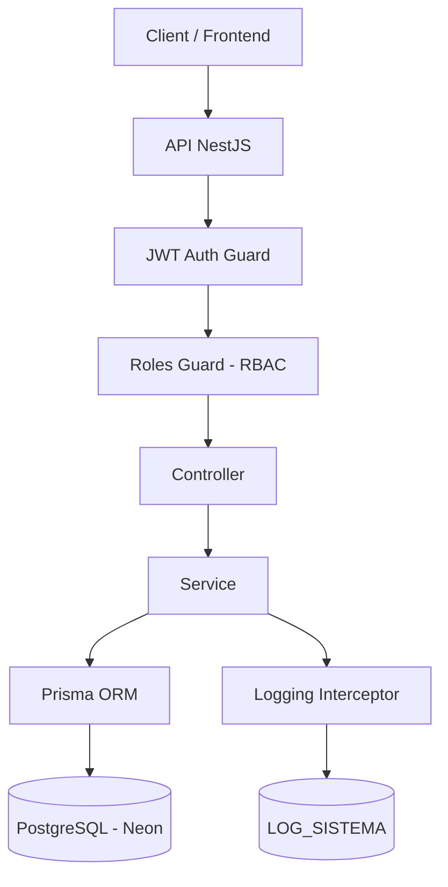

# CAMM — Sistema de Gestao da ONG

**Centro de Atendimento a Meninos e a Meninas**

> Plataforma completa para digitalizacao e gestao operacional da ONG CAMM.
> Foco em **controle, rastreabilidade, seguranca e eficiencia**.

**Producao:** [ongcamm4.vercel.app](https://ongcamm4.vercel.app) | **API Docs:** [ongcamm4-api.onrender.com/api/docs](https://ongcamm4-api.onrender.com/api/docs)

---

## Problema Resolvido

| Antes | Depois |
|-------|--------|
| Controle manual de presenca | Sistema centralizado e auditavel |
| Documentos fisicos | Upload digital com rastreabilidade |
| Falta de rastreabilidade | Historico completo de acoes (LogSistema) |
| Risco de perda de dados | Banco PostgreSQL em nuvem (Neon) |

---

## Stack Tecnologica

**Backend**
- NestJS (Node.js + TypeScript)
- Prisma ORM
- PostgreSQL (Neon serverless)
- JWT + Refresh Token (rotacao automatica)
- class-validator, Multer, pdf-lib
- Swagger (OpenAPI)

**Frontend**
- HTML5 + CSS3 + JavaScript (vanilla)
- Lucide Icons, Google Fonts (Nunito)
- Cloudflare Turnstile (CAPTCHA)

**Infraestrutura**
- Docker + Docker Compose + Nginx
- Deploy: Render (API) + Vercel (Frontend) + Neon (DB)

---

## Arquitetura



### Autenticacao e Autorizacao


### Modelagem de Dados


---

## Niveis de Acesso (RBAC)

| Operacao | Voluntario (1) | Gestor (2) | Diretor (3) |
|----------|---------------|-----------|------------|
| Visualizar criancas | Sim | Sim | Sim |
| Cadastrar criancas | — | Sim | Sim |
| Excluir criancas | — | — | Sim |
| Registrar frequencia | Sim | Sim | Sim |
| Gerar relatorios PDF | — | Sim | Sim |
| Gerenciar usuarios | — | — | Sim |
| Redefinir senhas | — | — | Sim |
| Auditoria / Logs | — | — | Sim |

---

## Funcionalidades

- **Cadastro de criancas** — dados pessoais, foto 3x4, genero, documentos e responsavel legal
- **Controle de frequencia** — registro diario com turno (Manha/Tarde/Integral) e justificativa de falta
- **Painel administrativo** — gestao de voluntarios, permissoes por nivel, atividades e doacoes
- **Relatorios em PDF** — criancas, frequencia, doacoes, atividades e auditoria (gerados em memoria)
- **Soft delete** — usuarios e criancas desativados podem ser visualizados com filtro
- **Dashboard** — metricas em tempo real, graficos de frequencia e doacoes (Chart.js), logs recentes, aniversariantes e alertas
- **Pagina Home** — Nossa Historia, Missao e Valores com banner institucional
- **Autenticacao segura** — JWT (1h) + Refresh Token (8h) com rotacao e validacao de sessao
- **Auditoria completa** — log automatico com entidade, entidade_id, IP e timestamp
- **CAPTCHA** — Cloudflare Turnstile na tela de login
- **Termos legais** — Termo de Responsabilidade e Uso de Imagem integrado
- **Declaracoes** — geracao de PDF restrita ao Diretor
- **Controle de visibilidade** — menu Administrativo oculto para voluntarios

---

## Estrutura do Projeto

```
ONGCAMM4/
├── Back-end/
│   ├── src/
│   │   ├── auth/              # JWT + Refresh Token
│   │   ├── usuarios/          # CRUD + reset senha
│   │   ├── criancas/          # CRUD de criancas
│   │   ├── responsaveis/      # CRUD de responsaveis
│   │   ├── frequencia/        # Registro de presenca
│   │   ├── atividades/        # Atividades da ONG
│   │   ├── eventos/           # Eventos externos
│   │   ├── doacoes/           # Registro de doacoes
│   │   ├── declaracoes/       # Declaracoes (PDF)
│   │   ├── relatorios/        # Relatorios em PDF
│   │   ├── dashboard/          # Metricas agregadas
│   │   ├── auditoria/         # Logs do sistema
│   │   ├── documentos/        # Upload de fotos/docs
│   │   ├── prisma/            # Prisma Service
│   │   └── common/            # Guards, decorators, interceptors
│   ├── prisma/
│   │   └── schema.prisma
│   ├── Dockerfile
│   └── package.json
├── Front-end/
│   ├── files/                 # HTML, CSS, JS, logo
│   ├── nginx.conf
│   └── Dockerfile
├── docker-compose.yml
├── vercel.json
└── README.md
```

---

## API

Prefixo global: `/api/v1` | Swagger: `/api/docs`

| Modulo | Endpoints | Acesso |
|--------|----------|--------|
| Auth | `POST /login`, `/refresh`, `/logout`, `GET /me` | Publico / Autenticado |
| Dashboard | `GET /dashboard/metrics` | Voluntario+ |
| Usuarios | CRUD + `PATCH /:id/reset-senha` | Gestor / Diretor |
| Criancas | CRUD completo | Voluntario+ |
| Responsaveis | CRUD completo | Voluntario+ |
| Frequencia | CRUD + historico por crianca | Voluntario+ |
| Relatorios | PDF de criancas, frequencia, doacoes, atividades, auditoria | Gestor+ |
| Doacoes, Atividades, Eventos | CRUD padrao | Gestor+ |
| Declaracoes | Geracao de PDF | Diretor |
| Auditoria | Logs do sistema | Diretor |

---

## Execucao

### Docker (recomendado)

```bash
docker compose up -d
# Frontend: http://localhost
# API:      http://localhost/api/v1
# Swagger:  http://localhost:3000/api/docs
```

### Desenvolvimento Local

```bash
# Backend
cd Back-end
npm install
npx prisma generate
npx prisma migrate dev
npm run start:dev

# Frontend — abrir com Live Server (VSCode)
```

---

## Deploy em Producao

| Servico | Plataforma | URL |
|---------|-----------|-----|
| Frontend | Vercel | [ongcamm4.vercel.app](https://ongcamm4.vercel.app) |
| Backend | Render (Docker) | [ongcamm4-api.onrender.com](https://ongcamm4-api.onrender.com) |
| Banco | NeonTech | PostgreSQL serverless (us-east-1) |
| CAPTCHA | Cloudflare Turnstile | Managed widget |

Auto-deploy: push na `main` atualiza Vercel e Render automaticamente.

---

## Diferenciais Tecnicos

- Arquitetura modular (NestJS)
- RBAC com Guards globais
- Autenticacao robusta (JWT 1h + Refresh Token 8h com rotacao)
- Validacao de sessao automatica ao reabrir pagina
- Auditoria via interceptor (entidade, ID, IP)
- Indices de performance em todas as tabelas criticas
- Banco serverless (Neon)
- Separacao clara: Controller / Service / ORM
- CAPTCHA anti-bot (Cloudflare Turnstile)
- Dashboard com metricas, graficos Chart.js e design glassmorphism
- Relatorios PDF gerados em memoria (sem dependencia de disco)
- Soft delete com filtro de excluidos
- Frequencia com turno e justificativa de falta
- Controle de visibilidade do menu por nivel de acesso

---

## Equipe

**Back-end**

| Membro | Responsabilidade |
|--------|-----------------|
| **Rickelme** | Arquitetura, auth, usuarios, criancas, responsaveis, documentos, dashboard, infra, deploy |
| **Lucas** | Frequencia, atividades, eventos, doacoes, declaracoes, relatorios, auditoria |

**Front-end**

| Membro | Responsabilidade |
|--------|-----------------|
| **Sergio** | Estrutura inicial do frontend (HTML, CSS, layout base) |
| **Rickelme** | Redesign UI/UX, integracao com API, dashboard, seguranca (XSS, CAPTCHA), correcoes, funcionalidades novas, deploy |

### Autor Principal

**Rickelme David**
Olinda - PE, Brasil

[GitHub](https://github.com/RickelmeDSC) | [LinkedIn](https://www.linkedin.com/in/rickelme-david-75630b203/)

---

## Licenca

Projeto publico — uso exclusivo da ONG CAMM.
